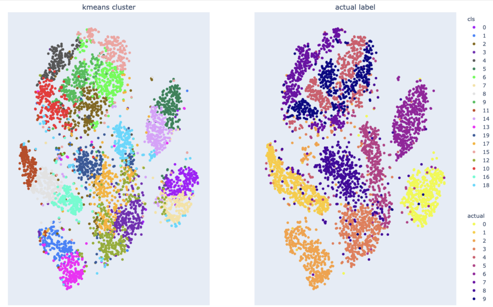
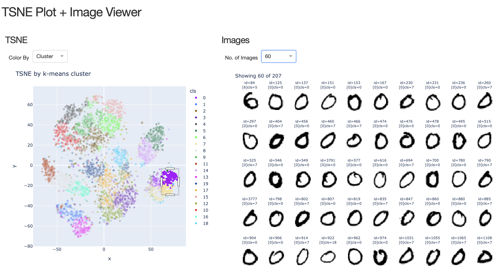

# mnist_with_kmeans_tsne
This is a project to explore the mnist dataset:
- with kmeans clustering
- tsne visualization
- plotly dash to browse both of the above

# Clustering
Viewing sampled mnist dataset with tsne + k-means cluster via plotly

# Interactive Viewing
A interactive dash application is created to view the above. 

Sampled mnist dataset can be selected from the tnse plot (which is colored by kmeans cluster or actual labels). The images are then displayed on the right panel. Number of images can be increased if required.

